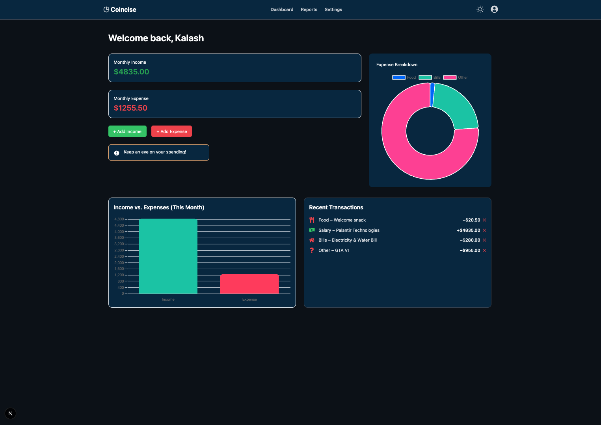
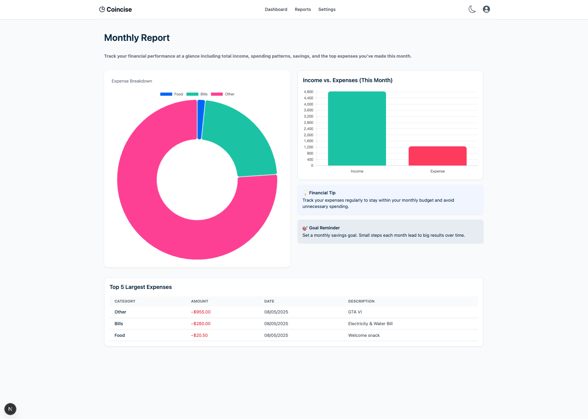

# 💰 Coincise – Personal Finance Tracker

Coincise is a modern full-stack personal finance tracking web app. It helps users manage their income, expenses, and budgets with an intuitive dashboard, interactive charts, and a smooth user experience.

## 🔗 Live Demo

🌐 [View Coincise App](https://your-vercel-url.vercel.app)

---

## ✨ Features

- 🔐 **Authentication** – Register/Login with JWT-based custom auth
- 💸 **Add Transactions** – Track income and expenses with date, category, and notes
- 📊 **Dashboard Charts** – Expense breakdown (Doughnut) & income vs expense (Bar)
- 📅 **Monthly Reports** – Summary with top 5 expenses
- 🌓 **Dark Mode Toggle** – Seamlessly switch between light/dark themes
- 🧪 **Mock Data Onboarding** – First-time users see mock data for better experience
- 🧹 **Delete Transactions** – Remove unwanted records
- 🔒 **Protected Pages** – Dashboard & reports accessible only when logged in
- 📱 **Responsive Design** – Fully optimized for desktop, tablet, and mobile

---

## 🛠 Tech Stack

**Frontend:**

- Next.js 13 (App Router)
- TypeScript
- Tailwind CSS
- Chart.js (via react-chartjs-2)
- Axios

**Backend:**

- Node.js & Express.js
- MongoDB Atlas with Mongoose
- JWT Authentication
- Bcrypt Password Hashing

---

## 📂 Project Structure

```perl
.
├── components/
│   ├── Navbar.tsx
│   ├── ExpenseModal.tsx
│   ├── ExpenseChart.tsx
│   ├── IncomeExpenseChart.tsx
│   └── RecentTransactions.tsx
├── context/
│   ├── AuthContext.tsx
│   └── ThemeContext.tsx
├── pages/
│   ├── index.tsx        → Dashboard
│   ├── reports.tsx      → Monthly Report
│   ├── settings.tsx     → Placeholder
│   ├── login.tsx
│   └── register.tsx
└── backend/
├── controllers/
├── models/
├── routes/
└── server.js
```

---

## 🚀 Getting Started

### 1. Clone the repository

```bash
git clone https://github.com/your-username/coincise.git
cd coincise
```

### 2. Setup Environment Variables

Create a .env file in both / and /backend/ with:

```bash
# For frontend (optional)
NEXT_PUBLIC_API_URL=http://localhost:5005

# For backend
MONGO_URI=your_mongodb_connection_string
JWT_SECRET=your_jwt_secret
PORT=5005
```

### 3. Install dependencies

```bash
# Frontend
npm install

# Backend
cd backend
npm install
```

### 4. Run locally

```bash
# Frontend
npm run dev

# Backend (in /backend)
npm run start
```

---

🔒 Authentication

- **Custom JWT auth**
- **Token stored in localStorage**
- **AuthContext manages login/logout state across pages**

---

📈 Charts

- **Expense Breakdown (Doughnut Chart)**
- **Income vs Expense (Bar Chart)**
- **Top 5 Expenses (Table in Reports page)**

---

📦 Deployments

- **Frontend: Vercel**
- **Backend: Render**

---

📸 Screenshots

<p align="center">
  
  
</p>

---

## 🧠 Inspiration

Built as part of a portfolio project to demonstrate real-world full-stack development skills in the FinTech space. Designed with recruiters and users in mind — easy to navigate, beautiful UI, and focused features.

---

## 📬 Contact

Feel free to connect on LinkedIn or check out more of my work on GitHub.
